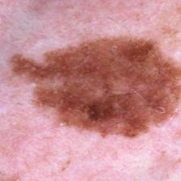

# Welcome! 

The model can be found at `'./Melanoma Classification/'`  
The backend server can be found at `'./Backend Server/'`  
The android app can be found at `'./Android/'`  

# How to use the app:
## Starting the server 
1. cd into `'./Backend Server/'`
2. open your command line and type `pip install requirements.txt`
3. type in `python app.py` as soon as the libraries are done installing
## Downloading the app
1. Download app.apk onto your Android device from `'./Android'` *
2. Run the app!  
\* you may also compile the app yourself by going into android studio and compiling from there.
# What's the purpose of this app?
Well, for most people it can be nearly impossible to distinguish the difference between a benign mole and a melanomatous tumour. Look at the two images below, and see if you can tell which one is malignant, and which one is benign.   

  
Because the two look so similar, many give themselves the benefit of the doubt and choose to believe that it's benign. However, this harmful way of thinking is one of the reasons why Melanoma is one of the most common types of cancers around the world (affecting more than 100,000 Americans every year). With the 95.7% test accuracy of our model, we've decided to incorporate it with an Android app that can help you detect malignant Melanoma before it's too late.
# ***HOWEVER PLEASE DO VISIT A DOCTOR IF YOU SUSPECT YOU HAVE MELANOMA. In no way does our app serve as a replacement of visiting a trained professional. Going to the doctor is the only way you may have a 100% chance of detecting Melanoma.